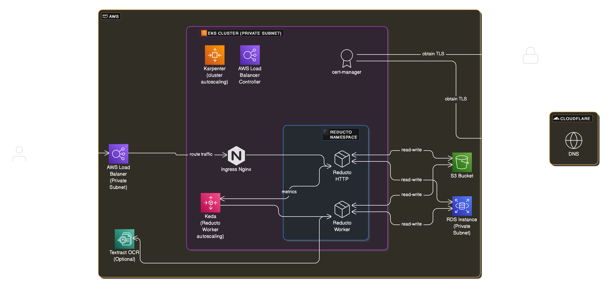

# Reducto 

Install Reducto on EKS using Terraform.



## Overview

The project creates [Helm Release](./reducto-helm-release.tf) for Reducto on EKS in `reducto` namespace. And creates following required dependencies:
1. [RDS instance](./reducto-db.tf)
2. [S3 bucket](./reducto-bucket.tf)
3. [Keda](./keda.tf) (for autoscaling of Reducto workers in-cluster)
4. Auto scaling of cluster nodes ([Karpenter](./karpenter.tf) is configured, however you can use any cluster autoscaling tool)
5. [AWS Load balancer controller](./aws-load-balancer-controller.tf) or [Ingress Nginx](./ingress-nginx-controller.tf) (however you can use any ingress controller)

This project demonstrates fully working cluster that's needed to run Reducto.
Cloudflare is not a requirement, however its used here to setup TLS along with cert-manager.

## Helm Chart

To obtain or inspect Helm Chart and available configurations in `values.yaml`

```
# Login
helm registry login registry.reducto.ai \
    --username <your-username>  \
    --password <your-password>

# Get latest Helm Chart
helm pull oci://registry.reducto.ai/reducto-api/reducto
```


## Security

All worklods are only created in private subnet, including NLB for ingress-nginx.

For bootstrapping of the cluster both public and private endpoints are enabled, public endpoint access can be restricted or removed after provisioning:

1. Remove public endpoint `cluster_endpoint_public_access = false`.
2. Restrict public endpoint `cluster_endpoint_public_access_cidrs = [ vpc_cidr ]`


### Terraform State

To use a bucket for Terraform state, create a bucket and update `backend.tf`.

OR you can skip this to quickly run Terraform plan and apply with locally managed `terraform.tfstate` state file for testing purposes.

### Configuration

Make sure `variables.tf` has configuration that you desire, like restricting EKS public endpoint, avoiding VPC CIDR collisions, or database instance type.

Create `terraform.tfvars` with following contents:

```
reducto_helm_repo_username = "todo"
reducto_helm_repo_password = "todo"
reducto_host = "reducto.example.com"
cloudflare_api_token = "token"
```

### Provisioning

Apply Terraform

```
terraform init
terraform plan
terraform apply
```

### Configure Cloudflare DNS

Cloudflare DNS is used to obtain TLS certificate from Letsencrypt via [cert-manager using dns01 solver](https://cert-manager.io/docs/configuration/acme/dns01/cloudflare/).

Check the private LB hostname created by cluster for Nginx Ingress Controller and use it to create CNAME DNS record on Cloudflare to point to value provided in `reducto_host`.

### Access Reducto

Reducto will be accessible on ingress-nginx NLB via hostname configured in `reducto_host`

For checking Reducto service health without public endpoint: port forward your local 4567 to Reducto service:

```
kubectl port-forward service/reducto-reducto-http 4567:80 -n reducto

# Access Reducto
curl localhost:4567
```

## Notes on Destroy

To `terraform destroy`, comment out the `lifecycle` block in `reducto-bucket.tf` and remove deletion protection from DB.

You can remove deletion protection by setting `var.db_deletion_protection = false` and `terraform apply`.

`terraform destroy` may not finish because VPC will contain resources created outside of Terraform managment:
- NLB for nginx controller created by AWS load balancer controller
- EKS Nodes from autoscaling by Karpenter
- Bucket not empty

So along side `terraform destroy` you'll need to manually delete above resources from AWS console.

