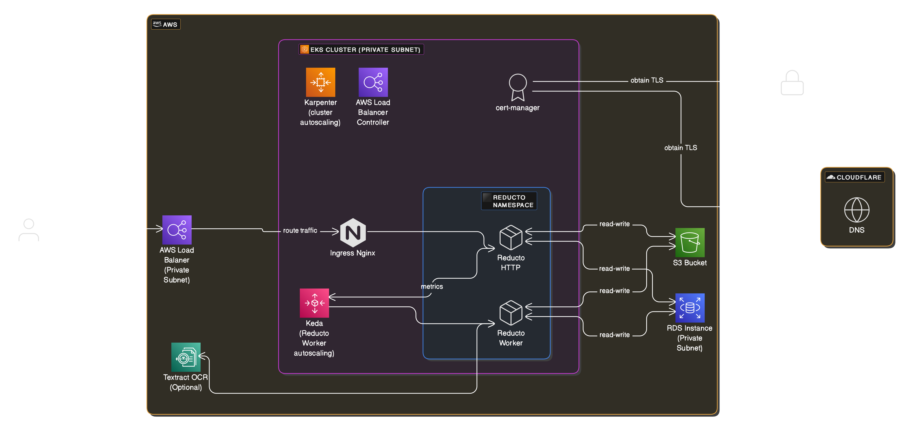

# Reducto

Install Reducto on EKS using Terraform.



## Overview

The project creates [Helm Release](./reducto-helm-release.tf) for Reducto on EKS in `reducto` namespace. And creates following required dependencies:
1. [RDS instance](./reducto-db.tf)
2. [S3 bucket](./reducto-bucket.tf)
3. [Keda](./keda.tf) (for autoscaling of Reducto workers in-cluster)
4. Auto scaling of cluster nodes ([Karpenter](./karpenter.tf) is configured, however you can use any cluster autoscaling tool)
5. [AWS Load balancer controller](./aws-load-balancer-controller.tf) or [Ingress Nginx](./ingress-nginx-controller.tf) (however you can use any ingress controller)

This project demonstrates fully working cluster that's needed to run Reducto.
Cloudflare is not a requirement, however its used here to setup TLS along with cert-manager.

## Upgrades

For upgrade instructions and release notes, see [MIGRATION_GUIDE.md](./MIGRATION_GUIDE.md).

## Terraform Documentation

<!-- BEGIN_TF_DOCS -->
### Requirements

| Name | Version |
|------|---------|
| <a name="requirement_terraform"></a> [terraform](#requirement\_terraform) | >= 1.2.0 |
| <a name="requirement_aws"></a> [aws](#requirement\_aws) | 6.28.0 |
| <a name="requirement_helm"></a> [helm](#requirement\_helm) | 3.1.1 |
| <a name="requirement_kubectl"></a> [kubectl](#requirement\_kubectl) | 1.19.0 |
| <a name="requirement_kubernetes"></a> [kubernetes](#requirement\_kubernetes) | 3.0.1 |
| <a name="requirement_null"></a> [null](#requirement\_null) | 3.2.4 |
| <a name="requirement_random"></a> [random](#requirement\_random) | 3.8.0 |

### Providers

| Name | Version |
|------|---------|
| <a name="provider_aws"></a> [aws](#provider\_aws) | 6.28.0 |
| <a name="provider_helm"></a> [helm](#provider\_helm) | 3.1.1 |
| <a name="provider_kubectl"></a> [kubectl](#provider\_kubectl) | 1.19.0 |
| <a name="provider_kubernetes"></a> [kubernetes](#provider\_kubernetes) | 3.0.1 |
| <a name="provider_random"></a> [random](#provider\_random) | 3.8.0 |

### Modules

| Name | Source | Version |
|------|--------|---------|
| <a name="module_ebs_csi_irsa_role"></a> [ebs\_csi\_irsa\_role](#module\_ebs\_csi\_irsa\_role) | terraform-aws-modules/iam/aws//modules/iam-role-for-service-accounts | v6.4.0 |
| <a name="module_eks"></a> [eks](#module\_eks) | terraform-aws-modules/eks/aws | 21.15.1 |
| <a name="module_karpenter"></a> [karpenter](#module\_karpenter) | terraform-aws-modules/eks/aws//modules/karpenter | 21.12.0 |
| <a name="module_load_balancer_controller_irsa_role"></a> [load\_balancer\_controller\_irsa\_role](#module\_load\_balancer\_controller\_irsa\_role) | terraform-aws-modules/iam/aws//modules/iam-role-for-service-accounts | v6.4.0 |
| <a name="module_rds"></a> [rds](#module\_rds) | terraform-aws-modules/rds/aws | 7.1.0 |
| <a name="module_rds_proxy"></a> [rds\_proxy](#module\_rds\_proxy) | terraform-aws-modules/rds-proxy/aws | 4.2.1 |
| <a name="module_rds_proxy_sg"></a> [rds\_proxy\_sg](#module\_rds\_proxy\_sg) | terraform-aws-modules/security-group/aws | 5.2 |
| <a name="module_rds_sg"></a> [rds\_sg](#module\_rds\_sg) | terraform-aws-modules/security-group/aws | 5.2.0 |
| <a name="module_vpc"></a> [vpc](#module\_vpc) | terraform-aws-modules/vpc/aws | 6.6.0 |
| <a name="module_vpc_cni_irsa_role"></a> [vpc\_cni\_irsa\_role](#module\_vpc\_cni\_irsa\_role) | terraform-aws-modules/iam/aws//modules/iam-role-for-service-accounts | v6.4.0 |

### Resources

| Name | Type |
|------|------|
| [aws_db_subnet_group.default](https://registry.terraform.io/providers/hashicorp/aws/6.28.0/docs/resources/db_subnet_group) | resource |
| [aws_iam_role.rds_enhanced_monitoring](https://registry.terraform.io/providers/hashicorp/aws/6.28.0/docs/resources/iam_role) | resource |
| [aws_iam_role.reducto](https://registry.terraform.io/providers/hashicorp/aws/6.28.0/docs/resources/iam_role) | resource |
| [aws_iam_role_policy.reducto](https://registry.terraform.io/providers/hashicorp/aws/6.28.0/docs/resources/iam_role_policy) | resource |
| [aws_iam_role_policy_attachment.rds_enhanced_monitoring](https://registry.terraform.io/providers/hashicorp/aws/6.28.0/docs/resources/iam_role_policy_attachment) | resource |
| [aws_s3_bucket.reducto_storage](https://registry.terraform.io/providers/hashicorp/aws/6.28.0/docs/resources/s3_bucket) | resource |
| [aws_s3_bucket_lifecycle_configuration.reducto_storage_lifecycle](https://registry.terraform.io/providers/hashicorp/aws/6.28.0/docs/resources/s3_bucket_lifecycle_configuration) | resource |
| [aws_s3_bucket_public_access_block.reducto_storage_public_access_block](https://registry.terraform.io/providers/hashicorp/aws/6.28.0/docs/resources/s3_bucket_public_access_block) | resource |
| [aws_secretsmanager_secret.superuser](https://registry.terraform.io/providers/hashicorp/aws/6.28.0/docs/resources/secretsmanager_secret) | resource |
| [aws_secretsmanager_secret_version.superuser](https://registry.terraform.io/providers/hashicorp/aws/6.28.0/docs/resources/secretsmanager_secret_version) | resource |
| [aws_security_group_rule.allow_all_cluster_and_nodes_traffic](https://registry.terraform.io/providers/hashicorp/aws/6.28.0/docs/resources/security_group_rule) | resource |
| [aws_security_group_rule.allow_all_cluster_and_nodes_traffic_ingress](https://registry.terraform.io/providers/hashicorp/aws/6.28.0/docs/resources/security_group_rule) | resource |
| [aws_security_group_rule.allow_all_intra_node_traffic](https://registry.terraform.io/providers/hashicorp/aws/6.28.0/docs/resources/security_group_rule) | resource |
| [aws_security_group_rule.allow_eks_cluster_access_from_vpc](https://registry.terraform.io/providers/hashicorp/aws/6.28.0/docs/resources/security_group_rule) | resource |
| [aws_security_group_rule.webhook_admission_inbound](https://registry.terraform.io/providers/hashicorp/aws/6.28.0/docs/resources/security_group_rule) | resource |
| [aws_security_group_rule.webhook_admission_outbound](https://registry.terraform.io/providers/hashicorp/aws/6.28.0/docs/resources/security_group_rule) | resource |
| [helm_release.aws_load_balancer_controller](https://registry.terraform.io/providers/hashicorp/helm/3.1.1/docs/resources/release) | resource |
| [helm_release.cert_manager](https://registry.terraform.io/providers/hashicorp/helm/3.1.1/docs/resources/release) | resource |
| [helm_release.datadog](https://registry.terraform.io/providers/hashicorp/helm/3.1.1/docs/resources/release) | resource |
| [helm_release.ingress_nginx](https://registry.terraform.io/providers/hashicorp/helm/3.1.1/docs/resources/release) | resource |
| [helm_release.karpenter](https://registry.terraform.io/providers/hashicorp/helm/3.1.1/docs/resources/release) | resource |
| [helm_release.karpenter-crd](https://registry.terraform.io/providers/hashicorp/helm/3.1.1/docs/resources/release) | resource |
| [helm_release.keda](https://registry.terraform.io/providers/hashicorp/helm/3.1.1/docs/resources/release) | resource |
| [helm_release.kube_prometheus_stack](https://registry.terraform.io/providers/hashicorp/helm/3.1.1/docs/resources/release) | resource |
| [helm_release.nvidia_device_plugin](https://registry.terraform.io/providers/hashicorp/helm/3.1.1/docs/resources/release) | resource |
| [helm_release.opentelemetry_collector](https://registry.terraform.io/providers/hashicorp/helm/3.1.1/docs/resources/release) | resource |
| [helm_release.prometheus_crds](https://registry.terraform.io/providers/hashicorp/helm/3.1.1/docs/resources/release) | resource |
| [helm_release.reducto](https://registry.terraform.io/providers/hashicorp/helm/3.1.1/docs/resources/release) | resource |
| [helm_release.telegraf](https://registry.terraform.io/providers/hashicorp/helm/3.1.1/docs/resources/release) | resource |
| [helm_release.vllm_stack](https://registry.terraform.io/providers/hashicorp/helm/3.1.1/docs/resources/release) | resource |
| [kubectl_manifest.cloudflare_api_secret](https://registry.terraform.io/providers/gavinbunney/kubectl/1.19.0/docs/resources/manifest) | resource |
| [kubectl_manifest.cluster_issuer](https://registry.terraform.io/providers/gavinbunney/kubectl/1.19.0/docs/resources/manifest) | resource |
| [kubectl_manifest.cluster_issuer_staging](https://registry.terraform.io/providers/gavinbunney/kubectl/1.19.0/docs/resources/manifest) | resource |
| [kubectl_manifest.cluster_manifests](https://registry.terraform.io/providers/gavinbunney/kubectl/1.19.0/docs/resources/manifest) | resource |
| [kubectl_manifest.datadog_secret](https://registry.terraform.io/providers/gavinbunney/kubectl/1.19.0/docs/resources/manifest) | resource |
| [kubectl_manifest.karpenter_node_class](https://registry.terraform.io/providers/gavinbunney/kubectl/1.19.0/docs/resources/manifest) | resource |
| [kubectl_manifest.karpenter_node_pool](https://registry.terraform.io/providers/gavinbunney/kubectl/1.19.0/docs/resources/manifest) | resource |
| [kubectl_manifest.monitoring_ns](https://registry.terraform.io/providers/gavinbunney/kubectl/1.19.0/docs/resources/manifest) | resource |
| [kubectl_manifest.otel_auth_secret](https://registry.terraform.io/providers/gavinbunney/kubectl/1.19.0/docs/resources/manifest) | resource |
| [kubectl_manifest.otel_datadog_secret](https://registry.terraform.io/providers/gavinbunney/kubectl/1.19.0/docs/resources/manifest) | resource |
| [kubectl_manifest.prometheus_rules](https://registry.terraform.io/providers/gavinbunney/kubectl/1.19.0/docs/resources/manifest) | resource |
| [kubectl_manifest.telegraf](https://registry.terraform.io/providers/gavinbunney/kubectl/1.19.0/docs/resources/manifest) | resource |
| [kubectl_manifest.telegraf_sm](https://registry.terraform.io/providers/gavinbunney/kubectl/1.19.0/docs/resources/manifest) | resource |
| [kubernetes_secret_v1.hf_token](https://registry.terraform.io/providers/hashicorp/kubernetes/3.0.1/docs/resources/secret_v1) | resource |
| [random_password.db_password](https://registry.terraform.io/providers/hashicorp/random/3.8.0/docs/resources/password) | resource |
| [random_string.secret_suffix](https://registry.terraform.io/providers/hashicorp/random/3.8.0/docs/resources/string) | resource |
| [aws_availability_zones.available](https://registry.terraform.io/providers/hashicorp/aws/6.28.0/docs/data-sources/availability_zones) | data source |
| [aws_eks_cluster_auth.eks](https://registry.terraform.io/providers/hashicorp/aws/6.28.0/docs/data-sources/eks_cluster_auth) | data source |
| [aws_iam_policy_document.rds_enhanced_monitoring](https://registry.terraform.io/providers/hashicorp/aws/6.28.0/docs/data-sources/iam_policy_document) | data source |
| [aws_iam_policy_document.reducto](https://registry.terraform.io/providers/hashicorp/aws/6.28.0/docs/data-sources/iam_policy_document) | data source |
| [kubectl_filename_list.cluster_manifests](https://registry.terraform.io/providers/gavinbunney/kubectl/1.19.0/docs/data-sources/filename_list) | data source |
| [kubectl_filename_list.prometheus_rules](https://registry.terraform.io/providers/gavinbunney/kubectl/1.19.0/docs/data-sources/filename_list) | data source |

### Inputs

| Name | Description | Type | Default | Required |
|------|-------------|------|---------|:--------:|
| <a name="input_cloudflare_api_token"></a> [cloudflare\_api\_token](#input\_cloudflare\_api\_token) | Cloudflare API token for Cert Manager to use DNS solver for issuing TLS certificates | `string` | n/a | yes |
| <a name="input_cluster_endpoint_public_access"></a> [cluster\_endpoint\_public\_access](#input\_cluster\_endpoint\_public\_access) | Enable public access to the EKS cluster API endpoint | `bool` | `true` | no |
| <a name="input_cluster_endpoint_public_access_cidrs"></a> [cluster\_endpoint\_public\_access\_cidrs](#input\_cluster\_endpoint\_public\_access\_cidrs) | List of CIDR blocks allowed to access the public EKS API endpoint | `list(string)` | <pre>[<br/>  "0.0.0.0/0"<br/>]</pre> | no |
| <a name="input_cluster_name"></a> [cluster\_name](#input\_cluster\_name) | Name of the EKS cluster and prefix for related resources | `string` | `"reducto-ai"` | no |
| <a name="input_datadog_api_key"></a> [datadog\_api\_key](#input\_datadog\_api\_key) | Datadog API key | `string` | `""` | no |
| <a name="input_datadog_site"></a> [datadog\_site](#input\_datadog\_site) | Datadog site | `string` | `"us3.datadoghq.com"` | no |
| <a name="input_db_deletion_protection"></a> [db\_deletion\_protection](#input\_db\_deletion\_protection) | Enable deletion protection for RDS database to prevent accidental deletion | `bool` | `true` | no |
| <a name="input_db_instance_class"></a> [db\_instance\_class](#input\_db\_instance\_class) | Instance class for Reducto Postgres database | `string` | `"db.t4g.medium"` | no |
| <a name="input_db_multi_az"></a> [db\_multi\_az](#input\_db\_multi\_az) | Enable Multi-AZ deployment for RDS database for high availability | `bool` | `true` | no |
| <a name="input_db_username"></a> [db\_username](#input\_db\_username) | Postgres DB username | `string` | `"reducto"` | no |
| <a name="input_enable_gpu_managed_node_group"></a> [enable\_gpu\_managed\_node\_group](#input\_enable\_gpu\_managed\_node\_group) | Whether to create the GPU managed node group (system\_gpu) for GPU workloads | `bool` | `false` | no |
| <a name="input_enable_nvidia_device_plugin"></a> [enable\_nvidia\_device\_plugin](#input\_enable\_nvidia\_device\_plugin) | Whether to install the NVIDIA device plugin for GPU support | `bool` | `false` | no |
| <a name="input_enable_otel_collector"></a> [enable\_otel\_collector](#input\_enable\_otel\_collector) | Whether to deploy the OpenTelemetry Collector on the cluster | `bool` | `false` | no |
| <a name="input_enable_reducto"></a> [enable\_reducto](#input\_enable\_reducto) | Whether to deploy the Reducto application via Helm | `bool` | `true` | no |
| <a name="input_enable_vllm_stack"></a> [enable\_vllm\_stack](#input\_enable\_vllm\_stack) | Whether to deploy the vLLM stack on the cluster | `bool` | `false` | no |
| <a name="input_otel_auth_token"></a> [otel\_auth\_token](#input\_otel\_auth\_token) | Auth token used by the OpenTelemetry collector | `string` | `""` | no |
| <a name="input_otel_datadog_api_key"></a> [otel\_datadog\_api\_key](#input\_otel\_datadog\_api\_key) | Datadog API key used by the OpenTelemetry collector exporter | `string` | `"admin"` | no |
| <a name="input_otel_host"></a> [otel\_host](#input\_otel\_host) | FQDN for exposing the OpenTelemetry Collector | `string` | `""` | no |
| <a name="input_private_subnets"></a> [private\_subnets](#input\_private\_subnets) | List of private subnets CIDRs | `list(string)` | `[]` | no |
| <a name="input_public_subnets"></a> [public\_subnets](#input\_public\_subnets) | List of public subnets CIDRs | `list(string)` | `[]` | no |
| <a name="input_reducto_helm_chart"></a> [reducto\_helm\_chart](#input\_reducto\_helm\_chart) | Path to Helm Chart on OCI registry | `string` | `"oci://registry.reducto.ai/reducto-api/reducto"` | no |
| <a name="input_reducto_helm_chart_version"></a> [reducto\_helm\_chart\_version](#input\_reducto\_helm\_chart\_version) | Reducto Helm Chart version | `string` | `"1.11.32"` | no |
| <a name="input_reducto_helm_repo_password"></a> [reducto\_helm\_repo\_password](#input\_reducto\_helm\_repo\_password) | Password for Helm Registry for Reducto Helm Chart | `string` | n/a | yes |
| <a name="input_reducto_helm_repo_username"></a> [reducto\_helm\_repo\_username](#input\_reducto\_helm\_repo\_username) | Username for Helm Registry for Reducto Helm Chart | `string` | n/a | yes |
| <a name="input_reducto_host"></a> [reducto\_host](#input\_reducto\_host) | Full host DNS for Reducto (Example: reducto.mydomain.com) | `string` | n/a | yes |
| <a name="input_region"></a> [region](#input\_region) | AWS region where resources will be created | `string` | `"us-east-1"` | no |
| <a name="input_slack_webhook_url"></a> [slack\_webhook\_url](#input\_slack\_webhook\_url) | Slack Webhook URL for Alertmanager | `string` | n/a | yes |
| <a name="input_vllm_stack_hf_token"></a> [vllm\_stack\_hf\_token](#input\_vllm\_stack\_hf\_token) | Hugging Face API token used by the vLLM stack for model access | `string` | `""` | no |
| <a name="input_vpc_cidr"></a> [vpc\_cidr](#input\_vpc\_cidr) | CIDR block for the VPC | `string` | `"10.125.0.0/16"` | no |

### Outputs

| Name | Description |
|------|-------------|
| <a name="output_cluster_certificate_authority_data"></a> [cluster\_certificate\_authority\_data](#output\_cluster\_certificate\_authority\_data) | Base64 encoded certificate data required to communicate with the cluster |
| <a name="output_cluster_endpoint"></a> [cluster\_endpoint](#output\_cluster\_endpoint) | Endpoint for EKS control plane |
| <a name="output_cluster_name"></a> [cluster\_name](#output\_cluster\_name) | Name of the EKS cluster |
| <a name="output_cluster_security_group_id"></a> [cluster\_security\_group\_id](#output\_cluster\_security\_group\_id) | Security group ID attached to the EKS cluster |
| <a name="output_configure_kubectl"></a> [configure\_kubectl](#output\_configure\_kubectl) | Command to configure kubectl for the EKS cluster |
| <a name="output_db_instance_endpoint"></a> [db\_instance\_endpoint](#output\_db\_instance\_endpoint) | Connection endpoint for the RDS instance |
| <a name="output_db_instance_name"></a> [db\_instance\_name](#output\_db\_instance\_name) | Name of the RDS database |
| <a name="output_db_proxy_arn"></a> [db\_proxy\_arn](#output\_db\_proxy\_arn) | ARN of the RDS Proxy |
| <a name="output_db_proxy_endpoint"></a> [db\_proxy\_endpoint](#output\_db\_proxy\_endpoint) | Connection endpoint for the RDS Proxy |
| <a name="output_oidc_provider_arn"></a> [oidc\_provider\_arn](#output\_oidc\_provider\_arn) | ARN of the OIDC Provider for EKS |
| <a name="output_private_subnets"></a> [private\_subnets](#output\_private\_subnets) | List of IDs of private subnets |
| <a name="output_public_subnets"></a> [public\_subnets](#output\_public\_subnets) | List of IDs of public subnets |
| <a name="output_reducto_host"></a> [reducto\_host](#output\_reducto\_host) | Hostname where Reducto is accessible |
| <a name="output_reducto_iam_role_arn"></a> [reducto\_iam\_role\_arn](#output\_reducto\_iam\_role\_arn) | ARN of the IAM role for Reducto service account |
| <a name="output_region"></a> [region](#output\_region) | AWS region where resources are deployed |
| <a name="output_s3_bucket_arn"></a> [s3\_bucket\_arn](#output\_s3\_bucket\_arn) | ARN of the S3 bucket for Reducto storage |
| <a name="output_s3_bucket_name"></a> [s3\_bucket\_name](#output\_s3\_bucket\_name) | Name of the S3 bucket for Reducto storage |
| <a name="output_vpc_id"></a> [vpc\_id](#output\_vpc\_id) | ID of the VPC |
<!-- END_TF_DOCS -->

## Helm Chart

To obtain or inspect Helm Chart and available configurations in `values.yaml`

```
# Login
helm registry login registry.reducto.ai \
    --username <your-username>  \
    --password <your-password>

# Get latest Helm Chart
helm pull oci://registry.reducto.ai/reducto-api/reducto
```


## Security

All worklods are only created in private subnet, including NLB for ingress-nginx.

For bootstrapping of the cluster both public and private endpoints are enabled, public endpoint access can be restricted or removed after provisioning:

1. Remove public endpoint `cluster_endpoint_public_access = false`.
2. Restrict public endpoint `cluster_endpoint_public_access_cidrs = [ vpc_cidr ]`


### Terraform State

To use a bucket for Terraform state, create a bucket and update `backend.tf`.

OR you can skip this to quickly run Terraform plan and apply with locally managed `terraform.tfstate` state file for testing purposes.

### Configuration

Make sure `variables.tf` has configuration that you desire, like restricting EKS public endpoint, avoiding VPC CIDR collisions, or database instance type.

Create `terraform.tfvars` with following contents:

```
reducto_helm_repo_username = "todo"
reducto_helm_repo_password = "todo"
reducto_host = "reducto.example.com"
cloudflare_api_token = "token"

# For alerting
slack_webhook_url = "todo"
```

### Provisioning

Apply Terraform

```
terraform init
terraform plan
terraform apply
```

### Configure Cloudflare DNS

Cloudflare DNS is used to obtain TLS certificate from Letsencrypt via [cert-manager using dns01 solver](https://cert-manager.io/docs/configuration/acme/dns01/cloudflare/).

Check the private LB hostname created by cluster for Nginx Ingress Controller and use it to create CNAME DNS record on Cloudflare to point to value provided in `reducto_host`.

### Access Reducto

Reducto will be accessible on ingress-nginx NLB via hostname configured in `reducto_host`

For checking Reducto service health without public endpoint: port forward your local 4567 to Reducto service:

```
kubectl port-forward service/reducto-reducto-http 4567:80 -n reducto

# Access Reducto
curl localhost:4567
```

## New AWS account

For Karpenter to [request spot instances](https://docs.aws.amazon.com/AWSEC2/latest/UserGuide/service-linked-roles-spot-instance-requests.html), create the service-linked role:

```sh
aws iam create-service-linked-role --aws-service-name spot.amazonaws.com
```

## Notes on Destroy

To `terraform destroy`, comment out the `lifecycle` block in `reducto-bucket.tf` and remove deletion protection from DB.

You can remove deletion protection by setting `var.db_deletion_protection = false` and `terraform apply`.

`terraform destroy` may not finish because VPC will contain resources created outside of Terraform managment:
- NLB for nginx controller created by AWS load balancer controller
- EKS Nodes from autoscaling by Karpenter
- Bucket not empty

So along side `terraform destroy` you'll need to manually delete above resources from AWS console.

## Notes on NLB for Nginx

To customize NLB configuration:
- See [AWS Load Balancer controller annotations](https://kubernetes-sigs.github.io/aws-load-balancer-controller/latest/guide/service/annotations/) for Service, and [Ingress Nginx Helm Chart](https://github.com/kubernetes/ingress-nginx/tree/helm-chart-4.11.2/charts/ingress-nginx) configuration.
- For [NLB TLS Termination](https://kubernetes-sigs.github.io/aws-load-balancer-controller/latest/guide/use_cases/nlb_tls_termination/) with ACM ssl cert (without cert-manager), configure target port in `values/ingress-nginx-controller.yaml`.
   ```
   service:
     targetPorts:
       https: http
   ```

## Monitoring

Reducto internal job queue length is a good indicator of overall worker health. And 5xx metric from Reducto ingress is a good indicator of API health.

`PrometheusRule` in `manifests/prometheus/rules/01-reducto.yaml` monitors internal queue length and 5xx metrics. When queue doesn't go down for a long duration OR API returns 5xx status for a long duration, alerts are sent to configured Slack channel.
